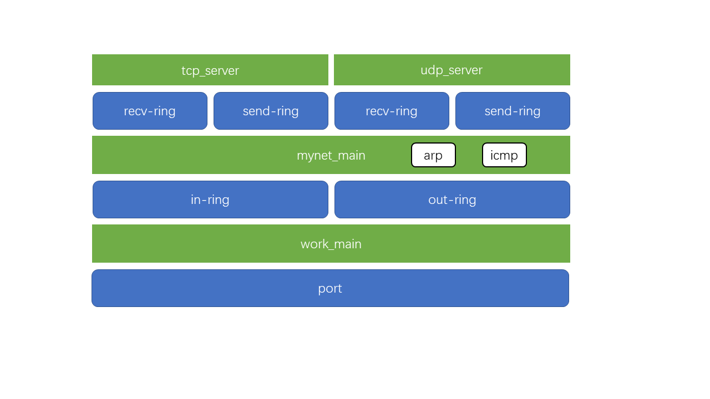

# 1 运行说明

依赖于 dpdk-23.11，在Ubuntu-22.04 sever设备中测试正常。

需要一个网卡，4个core

将 mynet 目录拷贝到 dpdk 源码 examples 目录下，执行以下命令

```
# cd example/mynet
# make
# ./build/mynet -l 0-3
```

# 2 逻辑架构

work_main线程负责从port接收buf写入in-ring，同时从out-ring读取buf发送到port；
mynet_main线程负责处理arp、icmp协议的数据包，tcp、udp协议的数据包上送到tcp_server和udp_server；



# 3 运行结果

## 3.1 启动

```bash
# ./build/mynet -l 0-3
EAL: Detected CPU lcores: 8
EAL: Detected NUMA nodes: 1
EAL: Detected shared linkage of DPDK
EAL: Multi-process socket /var/run/dpdk/rte/mp_socket
EAL: Selected IOVA mode 'PA'
EAL: VFIO support initialized
EAL: Using IOMMU type 8 (No-IOMMU)
EAL: Ignore mapping IO port bar(3)
EAL: Probe PCI driver: net_vmxnet3 (15ad:07b0) device: 0000:03:00.0 (socket -1)
TELEMETRY: No legacy callbacks, legacy socket not created
[ Core 0 port_init:119 ==> Port: 0, MAC: 00 0c 29 b2 8b 91 ]
[ Core 1 mynet_main:1104 ==> recv buf and send to socket. ]
[ Core 2 udp_server_main:605 ==> start. ]
[ Core 3 tcp_server_main:660 ==> start. ]
[ Core 0 work_main:1187 ==> forwarding packets, Ctrl+C to quit. ]
```

## 3.1 arp

```bash
  send arp request:
[ 00:0c:29:b2:8b:91 -> ff:ff:ff:ff:ff:ff ]
[ 192.168.1.120 -> 192.168.1.26 ]
[ 00:0c:29:b2:8b:91 -> 00:00:00:00:00:00 ]

  recv arp request:
[ 3c:f0:11:eb:bb:8a -> ff:ff:ff:ff:ff:ff ]
[ 192.168.1.26 -> 192.168.1.120 ]
[ 3c:f0:11:eb:bb:8a -> 00:00:00:00:00:00 ]

  send arp reply:
[ 00:0c:29:b2:8b:91 -> 3c:f0:11:eb:bb:8a ]
[ 192.168.1.120 -> 192.168.1.26 ]
[ 00:0c:29:b2:8b:91 -> 3c:f0:11:eb:bb:8a ]

```

## 3.2 icmp

```bash
  recv icmp echo request:
[ 3c:f0:11:eb:bb:8a -> 00:0c:29:b2:8b:91 ]
[ 192.168.1.26 -> 192.168.1.120 ]
[ ident=1, seq_nb=25 ]

  send icmp echo reply:
[ 00:0c:29:b2:8b:91 -> 3c:f0:11:eb:bb:8a ]
[ 192.168.1.120 -> 192.168.1.26 ]
[ ident=1, seq_nb=25 ]

```

## 3.3 udp

```
  recv udp pkt:
[ 3c:f0:11:eb:bb:8a -> 00:0c:29:b2:8b:91 ]
[ 192.168.1.26 -> 192.168.1.120 ]
[ 7777 -> 8888 ]
[ Core 2 udp_server_main:620 ==> UDP Client(20) : Welcome to NetAssist ]

  send udp pkt:
[ 3c:f0:11:eb:bb:8a -> 00:0c:29:b2:8b:91 ]
[ 192.168.1.120 -> 192.168.1.26 ]
[ 8888 -> 7777 ]
[ Core 2 udp_server_main:626 ==> UDP Server(20) ]

```

## 3.4 tcp
```
  recv tcp syn pkt:
[ 3c:f0:11:eb:bb:8a -> 00:0c:29:b2:8b:91 ]
[ 192.168.1.26 -> 192.168.1.120 ]
[ 7516 -> 8888, sent_seq=1546483887, recv_ack=0 ]

  send tcp syn ack pkt:
[ 00:0c:29:b2:8b:91 -> 3c:f0:11:eb:bb:8a ]
[ 192.168.1.120 -> 192.168.1.26 ]
[ 8888 -> 7516, sent_seq=180361296, recv_ack=1546483888 ]

  recv tcp ack pkt:
[ 3c:f0:11:eb:bb:8a -> 00:0c:29:b2:8b:91 ]
[ 192.168.1.26 -> 192.168.1.120 ]
[ 7516 -> 8888, sent_seq=1546483888, recv_ack=180361297 ]

  recv tcp psh pkt:
[ 3c:f0:11:eb:bb:8a -> 00:0c:29:b2:8b:91 ]
[ 192.168.1.26 -> 192.168.1.120 ]
[ 7516 -> 8888, sent_seq=1546483888, recv_ack=180361297 ]

  send tcp ack pkt:
[ 00:0c:29:b2:8b:91 -> 3c:f0:11:eb:bb:8a ]
[ 192.168.1.120 -> 192.168.1.26 ]
[ 8888 -> 7516, sent_seq=180361297, recv_ack=1546483908 ]
[ Core 3 tcp_server_main:679 ==> TCP Client(20) : Welcome to NetAssist ]

  send tcp psh pkt:
[ 00:0c:29:b2:8b:91 -> 3c:f0:11:eb:bb:8a ]
[ 192.168.1.120 -> 192.168.1.26 ]
[ 8888 -> 7516, sent_seq=180361297, recv_ack=1546483908 ]
[ Core 3 tcp_server_main:684 ==> TCP Server(20) ]

  recv tcp psh pkt:
[ 3c:f0:11:eb:bb:8a -> 00:0c:29:b2:8b:91 ]
[ 192.168.1.26 -> 192.168.1.120 ]
[ 7516 -> 8888, sent_seq=1546483908, recv_ack=180361317 ]

  send tcp ack pkt:
[ 00:0c:29:b2:8b:91 -> 3c:f0:11:eb:bb:8a ]
[ 192.168.1.120 -> 192.168.1.26 ]
[ 8888 -> 7516, sent_seq=180361317, recv_ack=1546483928 ]
[ Core 3 tcp_server_main:679 ==> TCP Client(20) : Welcome to NetAssist ]

  send tcp psh pkt:
[ 00:0c:29:b2:8b:91 -> 3c:f0:11:eb:bb:8a ]
[ 192.168.1.120 -> 192.168.1.26 ]
[ 8888 -> 7516, sent_seq=180361317, recv_ack=1546483928 ]
[ Core 3 tcp_server_main:684 ==> TCP Server(20) ]

  recv tcp fin pkt:
[ 3c:f0:11:eb:bb:8a -> 00:0c:29:b2:8b:91 ]
[ 192.168.1.26 -> 192.168.1.120 ]
[ 7516 -> 8888, sent_seq=1546483928, recv_ack=180361337 ]

  send tcp ack pkt:
[ 00:0c:29:b2:8b:91 -> 3c:f0:11:eb:bb:8a ]
[ 192.168.1.120 -> 192.168.1.26 ]
[ 8888 -> 7516, sent_seq=180361337, recv_ack=1546483929 ]
[ Core 3 tcp_server_main:688 ==> TCP Client disconnected. ]
[ Core 3 tcp_server_main:694 ==> TCP close client(5) ]

  send tcp fin pkt:
[ 00:0c:29:b2:8b:91 -> 3c:f0:11:eb:bb:8a ]
[ 192.168.1.120 -> 192.168.1.26 ]
[ 8888 -> 7516, sent_seq=180361337, recv_ack=1546483929 ]

  recv tcp ack pkt:
[ 3c:f0:11:eb:bb:8a -> 00:0c:29:b2:8b:91 ]
[ 192.168.1.26 -> 192.168.1.120 ]
[ 7516 -> 8888, sent_seq=1546483929, recv_ack=180361338 ]


```
